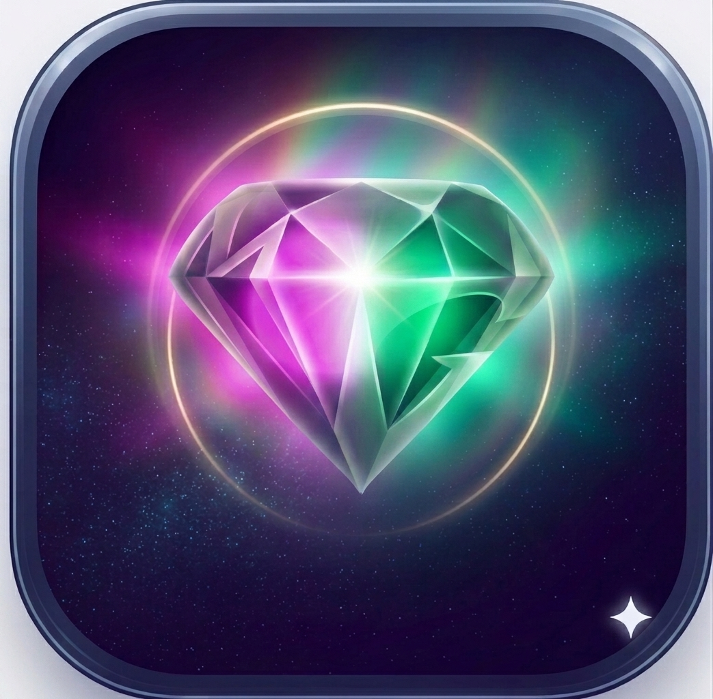

# 🔮 Gem-Memo

**AI資産を活用した、SNS発信メモアプリ**

思いついたアイデアをAIと一緒に育てる。ひらめきを、宝物へと。



---

## ✨ 機能

### 📝 メモタブ
- 構造化メモと自由形式メモの両対応
- リアルタイム自動保存（IndexedDB）
- ダーク/ライトテーマ切り替え

### ✏️ 生成タブ
- AI生成履歴の管理
- 発信記録の追跡
- 再利用可能なメモテンプレート

### 👤 プロフィールタブ
- SNS発信者情報の管理
- テーン・トーン・スタイル設定

### ⚙️ 設定タブ
- テーマ切り替え
- データバックアップ/復元
- 全データ削除機能

---

## 🚀 インストール方法

### Chrome / Edge（PC・スマートフォン）
1. **https://github.com/YOUR_USERNAME/Gem-Memo** にアクセス
2. **GitHub Pages** でアプリが開きます（右上に URL 表示）
3. ブラウザ右上の **インストールボタン** をクリック
4. **「アプリとしてインストール」** を選択

### インストール後
- ホーム画面にアイコン表示
- オフライン利用可能
- 自動更新対応

---

## 📱 ブラウザ対応

| ブラウザ | PC | スマートフォン |
|---------|-----|------------|
| Chrome | ✅ | ✅ |
| Edge | ✅ | ✅ |
| Safari | ⚠️ iOS 16.4+ | ⚠️ 制限あり |
| Firefox | ❌ | ❌ |

> **注：** PWA機能の完全サポートはChrome/Edgeが最適です

---

## 🔄 自動更新について

### バージョン管理
```html
<!-- index.html の meta タグ -->
<meta name="app-version" content="2026.07.01-2" />
```

このバージョン番号を変更するだけで、次回訪問時に **自動的に古いキャッシュが削除** されます。

### 更新フロー
1. `index.html` の `app-version` を変更
2. GitHub Pages にアップロード
3. ユーザーが次に訪問時に自動更新
   - キャッシュ自動削除 ✅
   - Service Worker 自動切替 ✅
   - ページ自動リロード ✅

ユーザーの手動操作は **不要** です。

---

## 💾 データ保存

### ローカル保存
- **IndexedDB** に全データを保存
- ブラウザのキャッシュクリアでもデータ残存
- デバイス間同期 ❌（非対応）

### バックアップ・復元
- 設定タブで **JSON形式** でエクスポート
- 別のデバイスで **インポート** 可能

---

## 🛠️ 技術スタック

| レイヤー | 技術 |
|---------|------|
| UI フレームワーク | React 18 (UMD) |
| ストレージ | IndexedDB |
| キャッシュ管理 | Service Worker |
| PWA | Web App Manifest |
| スタイル | CSS Custom Properties |

### 単一ファイル構成
- **index.html** のみでアプリ完成（CDN依存最小化）
- React/ReactDOM は CDN から読み込み
- IndexedDB ポリフィル を内蔵

---

## 📁 ファイル構成

```
Gem-Memo/
├── index.html          ← アプリ本体
├── sw.js              ← Service Worker（キャッシュ管理）
├── manifest.json      ← PWA設定
├── .nojekyll          ← GitHub Pages 設定
├── icon.png           ← PWA アイコン
├── 404.html           ← SPA用エラーハンドル
├── README.md          ← このファイル
└── LICENSE            ← ライセンス
```

---

## 🔧 開発・カスタマイズ

### ローカルでテスト
```bash
# Python サーバー起動
python3 -m http.server 8000

# ブラウザで開く
http://localhost:8000
```

### バージョン更新時
```
1. index.html の <meta name="app-version"> を変更
2. GitHub にコミット・プッシュ
3. 完了（ユーザーの再訪問時に自動更新）
```

### アイコン変更
```
icon.png を置き換え（1024×1024推奨）
→ manifest.json の icon 参照を変更
```

---

## 📝 使用方法

### 基本操作
1. **メモタブ** → アイデアをメモ
2. **生成タブ** → AI生成で発信を作成
3. **プロフィール** → 発信者情報設定
4. **設定** → テーマ変更・バックアップ

### キーボード操作
- iOS Safe Area対応（ノッチ・ホームインジケータ）
- ハードウェア戻るボタン対応（Android）

---

## 🤝 貢献

バグ報告・機能リクエストは **Issues** で受け付けています。

---

## 📄 ライセンス

このプロジェクトは MIT ライセンスの下で公開されています。

---

## 📧 サポート

- 🐛 **バグ報告** → Issues
- 💡 **機能提案** → Discussions
- ❓ **質問** → GitHub Issues

---

**Gem-Memo** — ひらめきを、宝物へと 🔮

Made with ❤️ using React & Service Workers
